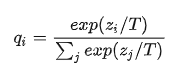
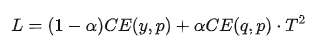

## 模型蒸馏原理
概念 -> 把一个大模型或者多个模型ensemble学到的知识迁移到另一个轻量级单模型上，方便部署。简单的说就是用小模型去学习大模型的预测结果，而不是直接学习训练集中的label。  
术语 ->  
- 教师模型：原始大模型
- 学生模型：新的小模型
- hard-label：训练集中标签
- soft-label：教师模型预测输出  
核心思想 -> **好模型的目标不是拟合训练数据，而是学习如何泛化到新的数据**  
理论上，学习soft-label的学生模型比学习hard-label的学生模型效果好  
## 如何蒸馏
1. 直接拿训练结果作为soft-label -> hard-label效果相似
2. 使用概率值 ->   
  
其中T用来更好的控制输出概率的平滑程度  
学生模型新的loss ->   
  
CE->交叉熵 y->真实label p->学生预测结果 a->蒸馏权重 T^2将梯度乘回  
## BERT蒸馏
蒸馏提升：  
- 精调阶段蒸馏->预训练阶段蒸馏
- 蒸馏最后一层知识->蒸馏隐层知识->蒸馏注意力矩阵  

### Distilled BiLSTM
将BERT-large蒸馏到单层BiLSTM中，参数量减少100倍，速度提升15倍，效果降低到ELMo  
- 教师模型：精调过的BERT-large
- 学生模型：BiLSTM+ReLU
- loss：CE(hrad-label)/MSE(logits)

### BERT-PKD
提出Patient Knowledge Distillation -> 从教师模型中间层提取知识，避免在蒸馏最后一层拟合过快  
  
PT LOSS -> 归一化后的MSE  
- 教师模型：精调BERT-base
- 学生模型：  
           PKD-skip -> BERT-base[2,4,6,8,10]  
           PKD-last -> BERT-base[7,8,9,10,11]  

### DIstillBERT
预训练阶段进行蒸馏，尺寸缩小40%，速度提升60%，效果好于BERT-PKD  
- 教师模型：预训练BERT-base
- 学生模型：6层transformer  
不同点：新增cosine embedding loss，蒸馏最后一层hidden
- loss：MLM loss、CE（最后一层）、cosine loss

### TinyBERT
